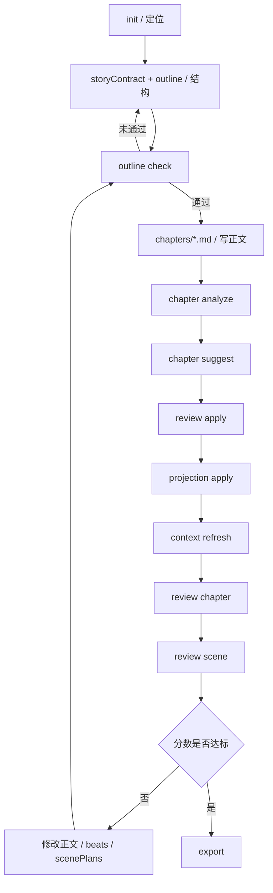

# 创作流程指南

> 最后更新: 2026-04-23
> 适用对象: 作者 / 外部 AI / 代理式写作者

## 1. 目标

把小说当作一个可回归、可评审、可迭代的工程项目。

## 2. 一句话流程

先定项目契约，再拆章节结构，再写正文；先分析，再评审；低分就改，改完复评，最后导出。

## 3. 完整闭环



## 4. 作者清单

1. 先写 `project.yaml` 里的 `positioning.primaryGenre`、`positioning.targetAudience`、`storyContract.corePromises`、`storyContract.paceContract`
2. 如果是商业连载，再补 `commercialPositioning.premise`、`hookLine`、`targetPlatform`、`serializationModel`、`releaseCadence` 和章节字数目标
3. 如需先定大结构，可先用 `structure list/apply/show/check` 选择三幕、五幕、英雄之旅或 Save the Cat 模板
4. 选定模板后，运行 `structure scaffold` 把结构模板直接落到具体章节方向和 `beats`；如有明确分配，再补 `structure map`
5. 再细化 `outline.yaml`，补章节级 `scenePlans` 与手工方向
6. 在开始正文或让 AI 继续细化前，先跑 `outline check`，确认章节已具备“项目契约 + direction + beats + scenePlans”
7. 写 `chapters/*.md` 时保留清晰的实体标记
8. 每写完一章先跑 `chapter analyze`
9. 再跑 `chapter suggest`、`review apply`、`projection apply`
10. 用 `context refresh` 生成下一轮上下文
11. 用 `review chapter` 和 `review scene` 评审质量；商业连载项目要同时看 `contractAlignment`、`commercialAlignment` 和 `weightedScores.profile.targetPlatform`
12. 用 `stats` 或 `doctor` 检查章节是否达到项目定义的字数区间；商业连载项目会优先读取 `commercialPositioning.chapterWordFloor/Target`
13. 分数低、结构偏移或字数不足就改正文、结构映射或场景边界，再复评
14. 最后 `export`

## 5. 外部 AI 清单

1. 先读 `project.yaml`
2. 再读 `outline.yaml`
3. 如果项目启用了结构模板，先看 `structures.yaml` 和章节 `beats` / `direction`
4. 跑 `outline check`，确认目标章节已具备大纲前置设计；未通过就先补 `project.yaml` 或 `outline.yaml`，不要直接细化正文
5. 读 `context-lens.yaml` 和目标章节
6. 跑 `chapter analyze`
7. 跑 `chapter suggest`
8. 跑 `review apply`
9. 跑 `projection apply`
10. 跑 `context refresh`
11. 跑 `review chapter`
12. 跑 `review scene`
13. 跑 `doctor` 或 `stats` 检查长度与结构落地情况
14. 如果弱项仍然明显，先改正文再复评
15. 直到达标或明确接受风险再停

## 6. Stop Conditions

可以停止的情况：

- 用户明确只要一轮
- `review chapter` 和 `review scene` 已经达到当前目标
- 剩余问题已经明确标记为可接受风险

不该停止的情况：

- `outline check` 仍未通过
- `priorityActions` 仍然指向明确的结构性问题
- 章节总分和一幕总分都明显偏低
- `contractAlignment` 仍然冲突
- 商业项目的 `commercialAlignment` 仍然是 `at-risk` 或关键风险未清

## 7. Fallback

如果 `story-harness` 命令不可用，使用：

```powershell
$env:PYTHONPATH='src'
python -m story_harness_cli <command> ...
```

## 8. 推荐阅读

- [快速上手](./quickstart.md)
- [样例工程矩阵](./sample-matrix.md)
- [小说工程初始化规范](./novel-engineering-init.md)

## 9. 推荐样例工程

- `demo-short-story`: 通用短篇回归基线，适合先验证章节分析、章节评审、一幕评审和导出闭环
- `demo-light-novel-short`: 风格化短篇基线，适合验证 `subGenre`、`styleTags`、`targetAudience` 是否进入评审输出
- `demo-xuanhuan-short`: 玄幻网文短篇基线，适合验证 `xuanhuan + web-serial` 的题材定位与节奏约束
- `demo-urban-occult-long`: 商业化长篇基线，适合验证卷级结构、章节门禁、字数检查、平台加权和连载型 workflow
